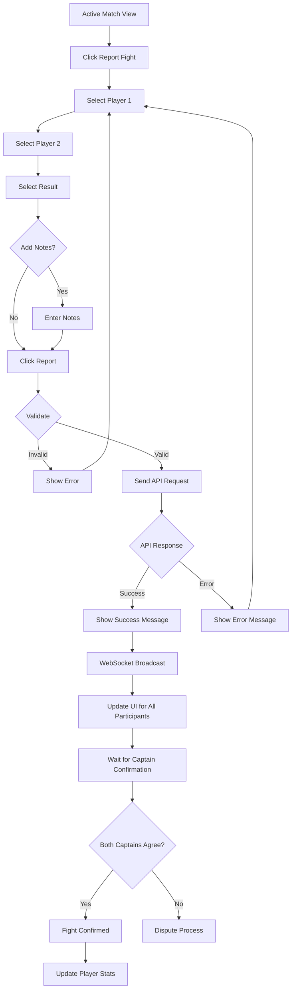

# Frontend Fight Reporting Implementation Guide

## Overview
This guide covers the complete implementation of the **Fight Reporting** feature, which allows match participants to report individual fight results during active matches. The system includes captain confirmation workflows and dispute resolution.

---

## 🎯 The Issue You're Facing

### **❌ Your Request (Incorrect)**
```json
{
  "matchId": "69787de5fec7b7444cd04181",
  "player1": "69759b1af81f442b742dcf98",
  "player2": "69738f0f181a25d1c81d6859",
  "result": "PLAYER1_WIN"
}
```

### **✅ Correct Request**
```json
{
  "matchId": "69787de5fec7b7444cd04181",
  "reporterId": "697xxxxxxxxxxxxxxxx",  // ← Missing field!
  "player1Id": "69759b1af81f442b742dcf98",  // ← Note: field name is player1Id
  "player2Id": "69738f0f181a25d1c81d6859",  // ← Note: field name is player2Id
  "result": "player1",  // ← Correct enum value (lowercase!)
  "resultNote": "Close fight, player1 got the cut"  // ← Optional
}
```

### **Key Differences:**
1. **Missing `reporterId`** - Must be the ID of the person reporting the fight
2. **Wrong field names** - Should be `player1Id` and `player2Id`, not `player1` and `player2`
3. **Wrong enum value** - Should be `"player1"` (lowercase), not `"PLAYER1_WIN"`

---

## 📡 API Endpoint

### **Report Fight Result**
```
POST /api/v1/fights
```

**Purpose**: Records the result of a fight between two players in an active match. Requires captain confirmation before becoming final.

---

## 🔐 Authentication
**Current Implementation**: No authentication middleware at route level. The `reporterId` is validated to ensure they are a participant in the match.

---

## 📥 Request Format

### **Request Body**
```typescript
{
  matchId: string;        // Match ID (24-char ObjectId) - REQUIRED
  reporterId: string;     // Reporter's player ID (24-char ObjectId) - REQUIRED
  player1Id: string;      // First fighter's ID (24-char ObjectId) - REQUIRED
  player2Id: string;      // Second fighter's ID (24-char ObjectId) - REQUIRED
  result: FightResult;    // Fight outcome - REQUIRED
  resultNote?: string;    // Optional description (max 500 chars)
}
```

### **Fight Result Enum Values**
```typescript
enum FightResult {
  PLAYER1 = 'player1',  // Player 1 wins
  PLAYER2 = 'player2',  // Player 2 wins
  DRAW = 'draw'         // Draw/tie
}
```

### **Complete Example**
```javascript
const reportFightResult = async (matchId, reporterId, player1Id, player2Id, winner) => {
  const response = await fetch('http://localhost:3000/api/v1/fights', {
    method: 'POST',
    headers: {
      'Content-Type': 'application/json',
    },
    body: JSON.stringify({
      matchId: matchId,
      reporterId: reporterId,
      player1Id: player1Id,
      player2Id: player2Id,
      result: winner, // 'player1', 'player2', or 'draw'
      resultNote: 'Optional note about the fight'
    })
  });

  if (!response.ok) {
    const error = await response.json();
    throw new Error(error.message);
  }

  return await response.json();
};

// Usage
await reportFightResult(
  '69787de5fec7b7444cd04181',
  '697xxxxxxxxxxxxxxxx',  // Current user's ID
  '69759b1af81f442b742dcf98',
  '69738f0f181a25d1c81d6859',
  'player1'  // player1 won
);
```

---

## 📤 Response Format

### **Success Response (201)**
```typescript
{
  _id: string;              // Fight ID
  matchId: string;          // Match ID
  matchType: 'friendly' | 'competitive';
  reportedBy: {
    playerId: string;
    playerName: string;
    reporterRole: 'captain_primary' | 'captain_secondary' | 'player';
  };
  player1: {
    playerId: string;
    playerName: string;
    teamId: string;
    teamName: string;
  };
  player2: {
    playerId: string;
    playerName: string;
    teamId: string;
    teamName: string;
  };
  proposedResult: 'player1' | 'player2' | 'draw';
  resultNote?: string;
  status: 'pending_captain_confirmation';
  captainConfirmations: [];
  createdAt: string;
  updatedAt: string;
}
```

### **Error Responses**

#### **400 - Missing Required Field**
```json
{
  "statusCode": 400,
  "code": "FST_ERR_VALIDATION",
  "error": "Bad Request",
  "message": "body must have required property 'reporterId'"
}
```

#### **400 - Invalid Enum Value**
```json
{
  "statusCode": 400,
  "code": "FST_ERR_VALIDATION",
  "error": "Bad Request",
  "message": "body/result must be equal to one of the allowed values"
}
```

#### **404 - Match Not Found**
```json
{
  "statusCode": 404,
  "error": "Not Found",
  "code": "NOT_FOUND",
  "message": "Match not found or not active"
}
```

#### **400 - Reporter Not a Participant**
```json
{
  "statusCode": 400,
  "error": "Bad Request",
  "code": "VALIDATION_ERROR",
  "message": "Reporter must be a match participant"
}
```

#### **400 - Players Not Participants**
```json
{
  "statusCode": 400,
  "error": "Bad Request",
  "code": "VALIDATION_ERROR",
  "message": "Both players must be match participants"
}
```

#### **400 - Players Not Confirmed**
```json
{
  "statusCode": 400,
  "error": "Bad Request",
  "code": "VALIDATION_ERROR",
  "message": "Both players must be confirmed participants"
}
```

---

## 🎯 Pre-Report Validations

### **Client-Side Validation**
```javascript
function canReportFight(match, currentUserId, player1Id, player2Id) {
  // 1. Match must be active
  if (match.status !== 'active') {
    return {
      allowed: false,
      reason: 'Fight can only be reported during active matches'
    };
  }

  // 2. Current user must be a participant
  const isParticipant = match.teams.some(team =>
    team.players.some(p => 
      p.playerId === currentUserId && 
      p.confirmationStatus === 'confirmed'
    )
  );

  if (!isParticipant) {
    return {
      allowed: false,
      reason: 'Only match participants can report fights'
    };
  }

  // 3. Both fighters must be different
  if (player1Id === player2Id) {
    return {
      allowed: false,
      reason: 'Cannot report a fight between the same player'
    };
  }

  // 4. Both fighters must be confirmed participants
  const player1Confirmed = match.teams.some(team =>
    team.players.some(p => 
      p.playerId === player1Id && 
      p.confirmationStatus === 'confirmed'
    )
  );

  const player2Confirmed = match.teams.some(team =>
    team.players.some(p => 
      p.playerId === player2Id && 
      p.confirmationStatus === 'confirmed'
    )
  );

  if (!player1Confirmed || !player2Confirmed) {
    return {
      allowed: false,
      reason: 'Both fighters must be confirmed match participants'
    };
  }

  return { allowed: true };
}
```

---

## 🔄 WebSocket Integration

### **Subscribe to Fight Updates**
```javascript
ws.onmessage = (event) => {
  const message = JSON.parse(event.data);
  
  switch (message.type) {
    case 'FIGHT_REPORTED':
      handleFightReported(message.data.fight, message.data.matchId);
      break;
    case 'FIGHT_CONFIRMED':
      handleFightConfirmed(message.data.fight, message.data.matchId);
      break;
    case 'FIGHT_DISPUTED':
      handleFightDisputed(message.data.fight, message.data.matchId);
      break;
    case 'FIGHT_COMPLETED':
      handleFightCompleted(message.data.fight, message.data.matchId);
      break;
  }
};
```

### **Fight Events**
```typescript
// When a fight is initially reported
{
  type: 'FIGHT_REPORTED',
  data: {
    fight: IFight,
    matchId: string
  },
  timestamp: string,
  matchId: string
}

// When both captains confirm
{
  type: 'FIGHT_CONFIRMED',
  data: {
    fight: IFight,
    matchId: string
  },
  timestamp: string,
  matchId: string
}
```

---

## 🎨 React Implementation Example

### **Fight Reporting Component**
```jsx
import { useState } from 'react';

function FightReportForm({ match, currentUserId, availablePlayers }) {
  const [player1, setPlayer1] = useState('');
  const [player2, setPlayer2] = useState('');
  const [result, setResult] = useState('');
  const [note, setNote] = useState('');
  const [loading, setLoading] = useState(false);
  const [error, setError] = useState(null);

  const handleSubmit = async (e) => {
    e.preventDefault();
    setError(null);

    // Validate
    const validation = canReportFight(match, currentUserId, player1, player2);
    if (!validation.allowed) {
      setError(validation.reason);
      return;
    }

    if (!result) {
      setError('Please select a fight result');
      return;
    }

    setLoading(true);

    try {
      const response = await fetch(`${API_BASE_URL}/api/v1/fights`, {
        method: 'POST',
        headers: {
          'Content-Type': 'application/json',
        },
        body: JSON.stringify({
          matchId: match._id,
          reporterId: currentUserId,
          player1Id: player1,
          player2Id: player2,
          result: result,  // 'player1', 'player2', or 'draw'
          resultNote: note || undefined
        })
      });

      if (!response.ok) {
        const error = await response.json();
        throw new Error(error.message);
      }

      const fight = await response.json();

      // Success
      showNotification({
        type: 'success',
        message: 'Fight reported successfully! Waiting for captain confirmation.'
      });

      // Reset form
      setPlayer1('');
      setPlayer2('');
      setResult('');
      setNote('');

      // Call parent callback
      onFightReported?.(fight);

    } catch (error) {
      setError(error.message || 'Failed to report fight');
    } finally {
      setLoading(false);
    }
  };

  return (
    <form onSubmit={handleSubmit} className="fight-report-form">
      <h3>Report Fight Result</h3>

      {error && (
        <div className="error-message">{error}</div>
      )}

      <div className="form-group">
        <label>Player 1</label>
        <select 
          value={player1} 
          onChange={(e) => setPlayer1(e.target.value)}
          required
        >
          <option value="">Select Player 1</option>
          {availablePlayers.map(player => (
            <option key={player._id} value={player._id}>
              {player.name} ({player.teamName})
            </option>
          ))}
        </select>
      </div>

      <div className="form-group">
        <label>Player 2</label>
        <select 
          value={player2} 
          onChange={(e) => setPlayer2(e.target.value)}
          required
        >
          <option value="">Select Player 2</option>
          {availablePlayers
            .filter(p => p._id !== player1)
            .map(player => (
              <option key={player._id} value={player._id}>
                {player.name} ({player.teamName})
              </option>
            ))
          }
        </select>
      </div>

      <div className="form-group">
        <label>Result</label>
        <div className="result-options">
          <button
            type="button"
            className={`result-btn ${result === 'player1' ? 'active' : ''}`}
            onClick={() => setResult('player1')}
          >
            Player 1 Wins
          </button>
          <button
            type="button"
            className={`result-btn ${result === 'draw' ? 'active' : ''}`}
            onClick={() => setResult('draw')}
          >
            Draw
          </button>
          <button
            type="button"
            className={`result-btn ${result === 'player2' ? 'active' : ''}`}
            onClick={() => setResult('player2')}
          >
            Player 2 Wins
          </button>
        </div>
      </div>

      <div className="form-group">
        <label>Notes (Optional)</label>
        <textarea
          value={note}
          onChange={(e) => setNote(e.target.value)}
          maxLength={500}
          placeholder="Add any details about the fight..."
          rows={3}
        />
        <small>{note.length}/500 characters</small>
      </div>

      <button 
        type="submit" 
        disabled={loading || !player1 || !player2 || !result}
        className="submit-btn"
      >
        {loading ? 'Reporting...' : 'Report Fight'}
      </button>
    </form>
  );
}
```

---

## 📊 State Management

### **Redux Actions**
```javascript
// Action creators
export const reportFight = (fightData) => async (dispatch) => {
  dispatch({ type: 'REPORT_FIGHT_REQUEST', payload: fightData });
  
  try {
    const response = await api.post('/fights', {
      matchId: fightData.matchId,
      reporterId: fightData.reporterId,
      player1Id: fightData.player1Id,
      player2Id: fightData.player2Id,
      result: fightData.result,
      resultNote: fightData.resultNote
    });
    
    dispatch({
      type: 'REPORT_FIGHT_SUCCESS',
      payload: response.data
    });
    
    return response.data;
  } catch (error) {
    dispatch({
      type: 'REPORT_FIGHT_FAILURE',
      payload: error.response?.data || { message: error.message }
    });
    
    throw error;
  }
};

// Reducer
const fightReducer = (state = initialState, action) => {
  switch (action.type) {
    case 'REPORT_FIGHT_REQUEST':
      return {
        ...state,
        reporting: true,
        error: null
      };
      
    case 'REPORT_FIGHT_SUCCESS':
      return {
        ...state,
        reporting: false,
        fights: [...state.fights, action.payload],
        pendingFights: [...state.pendingFights, action.payload]
      };
      
    case 'REPORT_FIGHT_FAILURE':
      return {
        ...state,
        reporting: false,
        error: action.payload.message
      };
      
    case 'FIGHT_CONFIRMED': // From WebSocket
      return {
        ...state,
        fights: state.fights.map(f =>
          f._id === action.payload._id ? action.payload : f
        ),
        pendingFights: state.pendingFights.filter(f => f._id !== action.payload._id),
        confirmedFights: [...state.confirmedFights, action.payload]
      };
      
    default:
      return state;
  }
};
```

---

## 🎬 Complete User Flow



---

## 📝 TypeScript Interfaces

```typescript
// Request
interface ReportFightRequest {
  matchId: string;
  reporterId: string;
  player1Id: string;
  player2Id: string;
  result: FightResult;
  resultNote?: string;
}

// Response
interface Fight {
  _id: string;
  matchId: string;
  matchType: 'friendly' | 'competitive';
  reportedBy: {
    playerId: string;
    playerName: string;
    reporterRole: 'captain_primary' | 'captain_secondary' | 'player';
  };
  player1: FightParticipant;
  player2: FightParticipant;
  proposedResult: FightResult;
  resultNote?: string;
  status: FightStatus;
  captainConfirmations: CaptainConfirmation[];
  createdAt: string;
  updatedAt: string;
}

interface FightParticipant {
  playerId: string;
  playerName: string;
  teamId: string;
  teamName: string;
}

enum FightResult {
  PLAYER1 = 'player1',
  PLAYER2 = 'player2',
  DRAW = 'draw'
}

enum FightStatus {
  PENDING_CAPTAIN_CONFIRMATION = 'pending_captain_confirmation',
  CONFIRMED = 'confirmed',
  DISPUTED = 'disputed',
  ADMIN_REVIEW = 'admin_review',
  COMPLETED = 'completed',
  CANCELLED = 'cancelled'
}

interface CaptainConfirmation {
  captainId: string;
  captainName: string;
  teamId: string;
  agreedResult: FightResult;
  confirmedAt: string;
  notes?: string;
}
```

---

## 🎖️ Captain Confirmation Flow

### **How Captains Confirm Fight Results**

After a fight is reported, **BOTH team captains** must confirm the result before it becomes final.

#### **Confirmation Workflow:**
1. Player reports fight → Status: `pending_captain_confirmation`
2. First captain confirms → Still pending
3. Second captain confirms:
   - ✅ **Both agree** → Status: `confirmed`, player stats updated
   - ❌ **Disagree** → Status: `disputed`, admin review needed

---

## 📡 Captain Confirmation Endpoint

### **POST /api/v1/fights/:id/confirm**

**Purpose**: Allows team captains to confirm or dispute a reported fight result.

### **URL Parameters**
| Parameter | Type | Required | Description |
|-----------|------|----------|-------------|
| `id` | string | ✅ Yes | Fight ID (24-char MongoDB ObjectId) |

### **Request Body**
```typescript
{
  captainId: string;      // Captain's player ID - REQUIRED
  agreedResult: string;   // 'player1', 'player2', or 'draw' - REQUIRED
  notes?: string;         // Optional notes (max 500 chars)
}
```

### **Complete Example**
```javascript
const confirmFightResult = async (fightId, captainId, agreedResult, notes) => {
  const response = await fetch(`http://localhost:3000/api/v1/fights/${fightId}/confirm`, {
    method: 'POST',
    headers: {
      'Content-Type': 'application/json',
    },
    body: JSON.stringify({
      captainId: captainId,
      agreedResult: agreedResult,  // 'player1', 'player2', or 'draw'
      notes: notes || undefined
    })
  });

  if (!response.ok) {
    const error = await response.json();
    throw new Error(error.message);
  }

  return await response.json();
};

// Usage
await confirmFightResult(
  '678abc123def456789012345',  // Fight ID
  '697xxxxxxxxxxxxxxxx',        // Current captain's ID
  'player1',                     // Agreed result
  'I confirm player 1 won'       // Optional notes
);
```

### **Response (200)**
```typescript
{
  _id: string;
  matchId: string;
  reportedBy: {...};
  player1: {...};
  player2: {...};
  proposedResult: 'player1' | 'player2' | 'draw';
  status: 'pending_captain_confirmation' | 'confirmed' | 'disputed';
  captainConfirmations: [
    {
      captainId: string;
      captainName: string;
      teamId: string;
      agreedResult: 'player1' | 'player2' | 'draw';
      confirmedAt: string;
      notes?: string;
      confirmationOrder: 1 | 2;  // Who confirmed first/second
    }
  ];
  // If disputed:
  disputeDetails?: {
    reason: string;  // e.g., "Captains disagreed: player1 vs player2"
  };
  createdAt: string;
  updatedAt: string;
}
```

### **Error Responses**

#### **404 - Fight Not Found**
```json
{
  "statusCode": 404,
  "error": "Not Found",
  "code": "NOT_FOUND",
  "message": "Fight not found or already confirmed"
}
```

#### **400 - Not a Captain**
```json
{
  "statusCode": 400,
  "error": "Bad Request",
  "code": "VALIDATION_ERROR",
  "message": "Only team captains can confirm fights"
}
```

#### **400 - Already Confirmed**
```json
{
  "statusCode": 400,
  "error": "Bad Request",
  "code": "VALIDATION_ERROR",
  "message": "Captain already confirmed this fight"
}
```

---

## 🎨 React Captain Confirmation Component

### **Complete Implementation**
```jsx
import { useState, useEffect } from 'react';

function FightConfirmationCard({ fight, currentUserId, match }) {
  const [loading, setLoading] = useState(false);
  const [selectedResult, setSelectedResult] = useState('');
  const [notes, setNotes] = useState('');
  const [error, setError] = useState(null);

  // Check if current user is a captain
  const isCaptain = match.teams.some(
    team => team.captain.playerId === currentUserId
  );

  // Check if current user already confirmed
  const hasConfirmed = fight.captainConfirmations.some(
    conf => conf.captainId === currentUserId
  );

  // Get current user's team
  const myTeam = match.teams.find(
    team => team.captain.playerId === currentUserId
  );

  // Check if fight is still pending
  const isPending = fight.status === 'pending_captain_confirmation';

  // Pre-select the proposed result
  useEffect(() => {
    if (isPending && !hasConfirmed) {
      setSelectedResult(fight.proposedResult);
    }
  }, [fight.proposedResult, isPending, hasConfirmed]);

  const handleConfirm = async () => {
    if (!selectedResult) {
      setError('Please select a result');
      return;
    }

    setLoading(true);
    setError(null);

    try {
      const response = await fetch(
        `${API_BASE_URL}/api/v1/fights/${fight._id}/confirm`,
        {
          method: 'POST',
          headers: {
            'Content-Type': 'application/json',
          },
          body: JSON.stringify({
            captainId: currentUserId,
            agreedResult: selectedResult,
            notes: notes || undefined
          })
        }
      );

      if (!response.ok) {
        const error = await response.json();
        throw new Error(error.message);
      }

      const updatedFight = await response.json();

      // Check if both captains confirmed
      if (updatedFight.captainConfirmations.length === 2) {
        const agreed = updatedFight.status === 'confirmed';
        
        showNotification({
          type: agreed ? 'success' : 'warning',
          message: agreed 
            ? '✅ Both captains agreed! Fight confirmed.'
            : '⚠️ Captains disagreed. Fight sent for admin review.'
        });
      } else {
        showNotification({
          type: 'success',
          message: '✅ Your confirmation recorded. Waiting for other captain.'
        });
      }

      // Call parent callback
      onConfirmed?.(updatedFight);

    } catch (error) {
      setError(error.message || 'Failed to confirm fight');
    } finally {
      setLoading(false);
    }
  };

  // Don't show if not a captain
  if (!isCaptain) return null;

  // Show confirmation status if already confirmed
  if (hasConfirmed) {
    const myConfirmation = fight.captainConfirmations.find(
      conf => conf.captainId === currentUserId
    );

    return (
      <div className="fight-card confirmed">
        <div className="fight-header">
          <h4>Fight Result</h4>
          <span className="status-badge">
            {fight.status === 'confirmed' ? '✅ Confirmed' : 
             fight.status === 'disputed' ? '⚠️ Disputed' : 
             '⏳ Pending Other Captain'}
          </span>
        </div>

        <div className="fight-details">
          <div className="fighters">
            <span className={`fighter ${fight.proposedResult === 'player1' ? 'winner' : ''}`}>
              {fight.player1.playerName}
            </span>
            <span className="vs">vs</span>
            <span className={`fighter ${fight.proposedResult === 'player2' ? 'winner' : ''}`}>
              {fight.player2.playerName}
            </span>
          </div>

          <div className="your-confirmation">
            <strong>Your Confirmation:</strong>
            <span>{getResultLabel(myConfirmation.agreedResult)}</span>
            {myConfirmation.notes && (
              <p className="notes">{myConfirmation.notes}</p>
            )}
          </div>

          {fight.status === 'disputed' && (
            <div className="dispute-notice">
              ⚠️ {fight.disputeDetails?.reason}
            </div>
          )}
        </div>
      </div>
    );
  }

  // Show confirmation form if pending
  if (isPending) {
    return (
      <div className="fight-card pending">
        <div className="fight-header">
          <h4>Confirm Fight Result</h4>
          <span className="status-badge">⏳ Awaiting Your Confirmation</span>
        </div>

        {error && (
          <div className="error-message">{error}</div>
        )}

        <div className="fight-details">
          <div className="fighters">
            <span className={`fighter ${fight.proposedResult === 'player1' ? 'winner' : ''}`}>
              {fight.player1.playerName}
              {fight.player1.teamId === myTeam?.teamId && ' (Your Team)'}
            </span>
            <span className="vs">vs</span>
            <span className={`fighter ${fight.proposedResult === 'player2' ? 'winner' : ''}`}>
              {fight.player2.playerName}
              {fight.player2.teamId === myTeam?.teamId && ' (Your Team)'}
            </span>
          </div>

          <div className="reported-by">
            <small>
              Reported by: {fight.reportedBy.playerName} 
              {fight.reportedBy.reporterRole !== 'player' && 
                ` (${fight.reportedBy.reporterRole.replace('_', ' ')})`
              }
            </small>
          </div>

          <div className="result-selection">
            <label>Do you agree with this result?</label>
            <div className="result-options">
              <button
                type="button"
                className={`result-btn ${selectedResult === 'player1' ? 'active' : ''}`}
                onClick={() => setSelectedResult('player1')}
              >
                {fight.player1.playerName} Wins
              </button>
              <button
                type="button"
                className={`result-btn ${selectedResult === 'draw' ? 'active' : ''}`}
                onClick={() => setSelectedResult('draw')}
              >
                Draw
              </button>
              <button
                type="button"
                className={`result-btn ${selectedResult === 'player2' ? 'active' : ''}`}
                onClick={() => setSelectedResult('player2')}
              >
                {fight.player2.playerName} Wins
              </button>
            </div>
          </div>

          {selectedResult !== fight.proposedResult && (
            <div className="dispute-warning">
              ⚠️ You're selecting a different result. This will create a dispute.
            </div>
          )}

          <div className="notes-field">
            <label>Notes (Optional)</label>
            <textarea
              value={notes}
              onChange={(e) => setNotes(e.target.value)}
              maxLength={500}
              placeholder="Add any comments about this fight..."
              rows={2}
            />
            <small>{notes.length}/500 characters</small>
          </div>

          <button
            onClick={handleConfirm}
            disabled={loading || !selectedResult}
            className="confirm-btn"
          >
            {loading ? 'Confirming...' : 'Confirm Result'}
          </button>
        </div>
      </div>
    );
  }

  return null;
}

// Helper function
function getResultLabel(result) {
  switch (result) {
    case 'player1': return 'Player 1 Wins';
    case 'player2': return 'Player 2 Wins';
    case 'draw': return 'Draw';
    default: return result;
  }
}
```

---

## 🔔 Displaying Pending Confirmations

### **List Fights Awaiting Confirmation**
```jsx
function PendingConfirmationsList({ matchId, currentUserId, match }) {
  const [pendingFights, setPendingFights] = useState([]);
  const [loading, setLoading] = useState(true);

  useEffect(() => {
    fetchPendingFights();
  }, [matchId]);

  const fetchPendingFights = async () => {
    try {
      const response = await fetch(
        `${API_BASE_URL}/api/v1/fights/match/${matchId}?status=pending_captain_confirmation`
      );
      
      const fights = await response.json();
      
      // Filter fights where current user hasn't confirmed yet
      const isCaptain = match.teams.some(
        team => team.captain.playerId === currentUserId
      );

      if (isCaptain) {
        const awaitingMyConfirmation = fights.filter(
          fight => !fight.captainConfirmations.some(
            conf => conf.captainId === currentUserId
          )
        );
        setPendingFights(awaitingMyConfirmation);
      }
    } catch (error) {
      console.error('Failed to fetch pending fights:', error);
    } finally {
      setLoading(false);
    }
  };

  if (loading) return <div>Loading pending confirmations...</div>;

  if (pendingFights.length === 0) {
    return <div className="no-pending">No fights awaiting your confirmation</div>;
  }

  return (
    <div className="pending-confirmations-section">
      <h3>⏳ Fights Awaiting Your Confirmation ({pendingFights.length})</h3>
      
      <div className="pending-list">
        {pendingFights.map(fight => (
          <FightConfirmationCard
            key={fight._id}
            fight={fight}
            currentUserId={currentUserId}
            match={match}
            onConfirmed={fetchPendingFights}
          />
        ))}
      </div>
    </div>
  );
}
```

---

## 📱 Real-Time Updates via WebSocket

### **Listen for Confirmation Events**
```javascript
ws.onmessage = (event) => {
  const message = JSON.parse(event.data);
  
  switch (message.type) {
    case 'FIGHT_REPORTED':
      // New fight reported - check if you're a captain
      const fight = message.data.fight;
      if (amICaptain(fight.matchId)) {
        showNotification({
          type: 'info',
          message: '🥊 New fight reported! Please confirm the result.',
          action: () => navigateToFight(fight._id)
        });
        
        // Update pending list
        addToPendingList(fight);
      }
      break;

    case 'FIGHT_CONFIRMED':
      // Both captains agreed
      showNotification({
        type: 'success',
        message: '✅ Fight confirmed by both captains!'
      });
      removeFromPendingList(message.data.fight._id);
      updateFightsList(message.data.fight);
      break;

    case 'FIGHT_DISPUTED':
      // Captains disagreed
      showNotification({
        type: 'warning',
        message: '⚠️ Fight result disputed. Admin review required.'
      });
      removeFromPendingList(message.data.fight._id);
      updateFightsList(message.data.fight);
      break;
  }
};
```

---

## 🎯 Captain Confirmation States

### **State Diagram**
```
Fight Reported
      ↓
[pending_captain_confirmation]
      ↓
Captain 1 Confirms → Still [pending_captain_confirmation]
      ↓
Captain 2 Confirms
      ↓
   ┌──────────────┐
   │   Results    │
   │   Match?     │
   └──────────────┘
      ↙        ↘
    Yes         No
     ↓           ↓
[confirmed]  [disputed]
     ↓           ↓
Update Stats   Admin Review
```

---

## 🚨 Validation Logic

### **Pre-Confirmation Checks**
```javascript
function canConfirmFight(fight, currentUserId, match) {
  // 1. Must be a team captain
  const isCaptain = match.teams.some(
    team => team.captain.playerId === currentUserId
  );

  if (!isCaptain) {
    return {
      allowed: false,
      reason: 'Only team captains can confirm fights'
    };
  }

  // 2. Fight must be pending
  if (fight.status !== 'pending_captain_confirmation') {
    return {
      allowed: false,
      reason: `Fight is ${fight.status}, cannot confirm`
    };
  }

  // 3. Captain hasn't already confirmed
  const alreadyConfirmed = fight.captainConfirmations.some(
    conf => conf.captainId === currentUserId
  );

  if (alreadyConfirmed) {
    return {
      allowed: false,
      reason: 'You have already confirmed this fight'
    };
  }

  return { allowed: true };
}
```

---

## 📊 Confirmation Statistics

### **Display Confirmation Status**
```jsx
function FightConfirmationStatus({ fight }) {
  const totalCaptains = 2;
  const confirmedCount = fight.captainConfirmations.length;
  const percentage = (confirmedCount / totalCaptains) * 100;

  return (
    <div className="confirmation-status">
      <div className="progress-bar">
        <div 
          className="progress-fill" 
          style={{ width: `${percentage}%` }}
        />
      </div>
      
      <div className="confirmation-details">
        <span>{confirmedCount} of {totalCaptains} captains confirmed</span>
        
        {fight.captainConfirmations.map((conf, index) => (
          <div key={index} className="confirmation-item">
            ✅ {conf.captainName} ({conf.teamId}) - {getResultLabel(conf.agreedResult)}
            {conf.notes && <p className="conf-notes">{conf.notes}</p>}
          </div>
        ))}
        
        {confirmedCount < totalCaptains && (
          <div className="pending-item">
            ⏳ Waiting for {totalCaptains - confirmedCount} more captain(s)
          </div>
        )}
      </div>
    </div>
  );
}
```

---

## 🔍 Additional Endpoints

### **Get Fight by ID**
```
GET /api/v1/fights/:id
```

### **Get Match Fights**
```
GET /api/v1/fights/match/:matchId?status=pending_captain_confirmation
```

### **Get All Fights**
```
GET /api/v1/fights?status=pending_captain_confirmation&matchId=xxx
```

---

## 🚨 Error Handling

### **Comprehensive Error Handler**
```javascript
async function reportFightWithErrorHandling(fightData) {
  try {
    // Validate required fields
    if (!fightData.reporterId) {
      throw new Error('Reporter ID is required');
    }
    if (!fightData.player1Id || !fightData.player2Id) {
      throw new Error('Both player IDs are required');
    }
    if (!fightData.result) {
      throw new Error('Fight result is required');
    }

    // Validate result enum
    const validResults = ['player1', 'player2', 'draw'];
    if (!validResults.includes(fightData.result)) {
      throw new Error(`Result must be one of: ${validResults.join(', ')}`);
    }

    const response = await fetch(`${API_BASE_URL}/api/v1/fights`, {
      method: 'POST',
      headers: { 'Content-Type': 'application/json' },
      body: JSON.stringify({
        matchId: fightData.matchId,
        reporterId: fightData.reporterId,
        player1Id: fightData.player1Id,
        player2Id: fightData.player2Id,
        result: fightData.result,
        resultNote: fightData.resultNote
      })
    });

    if (!response.ok) {
      const error = await response.json();
      
      switch (error.statusCode) {
        case 400:
          if (error.code === 'FST_ERR_VALIDATION') {
            showError('Invalid request. Please check all fields.');
          } else if (error.message.includes('Reporter must be')) {
            showError('You must be a match participant to report fights');
          } else if (error.message.includes('Both players must be')) {
            showError('Both fighters must be confirmed match participants');
          }
          break;
          
        case 404:
          showError('Match not found or is no longer active');
          break;
          
        case 429:
          showError('Too many requests. Please wait and try again.');
          break;
          
        default:
          showError('Failed to report fight. Please try again.');
      }
      
      throw new Error(error.message);
    }

    return await response.json();

  } catch (error) {
    if (error.name === 'TypeError' && error.message === 'Failed to fetch') {
      showError('Network error. Please check your connection.');
    }
    throw error;
  }
}
```

---

## 🎯 Common Issues & Solutions

### **Issue 1: "body must have required property 'reporterId'"**
**Solution**: Ensure you're sending `reporterId` in the request body (the ID of the current user).

### **Issue 2: "body/result must be equal to one of the allowed values"**
**Solution**: Use lowercase enum values: `'player1'`, `'player2'`, or `'draw'` (NOT `'PLAYER1_WIN'`).

### **Issue 3: Wrong field names (player1 vs player1Id)**
**Solution**: Use `player1Id` and `player2Id`, not just `player1` and `player2`.

### **Issue 4: "Reporter must be a match participant"**
**Solution**: The `reporterId` must be one of the confirmed players in the match.

### **Issue 5: "Both players must be confirmed participants"**
**Solution**: Only confirmed players can fight. Check their `confirmationStatus` is `'confirmed'`.

---

## 🔔 Notification Messages

### **Success Messages**
```javascript
const successMessages = {
  reported: '✅ Fight reported! Waiting for captain confirmation.',
  withNote: '✅ Fight reported with details. Captains will review.',
  asCaptain: '✅ Fight reported! Your confirmation is recorded.'
};
```

### **Info Messages**
```javascript
const infoMessages = {
  pendingConfirmation: '⏳ Fight pending captain confirmation',
  bothCaptainsMustConfirm: 'ℹ️ Both team captains must confirm the result',
  youCanConfirm: '👍 As a captain, you can confirm this result'
};
```

---

## 🧪 Testing Checklist

### **Unit Tests**
- [ ] Field validation (required fields)
- [ ] Enum value validation
- [ ] Player selection logic

### **Integration Tests**
- [ ] Successful fight report
- [ ] Reporter not a participant error
- [ ] Players not confirmed error
- [ ] Match not active error
- [ ] Same player error

### **E2E Tests**
- [ ] Complete fight report flow
- [ ] Captain confirmation workflow
- [ ] WebSocket event reception
- [ ] Dispute handling

---

## 📞 Quick Reference

### **Correct Request Format**
```bash
curl -X POST http://localhost:3000/api/v1/fights \
  -H "Content-Type: application/json" \
  -d '{
    "matchId": "69787de5fec7b7444cd04181",
    "reporterId": "697xxxxxxxxxxxxxxxx",
    "player1Id": "69759b1af81f442b742dcf98",
    "player2Id": "69738f0f181a25d1c81d6859",
    "result": "player1",
    "resultNote": "Close fight"
  }'
```

### **Valid Result Values**
- ✅ `"player1"` - Player 1 wins
- ✅ `"player2"` - Player 2 wins
- ✅ `"draw"` - Tie/Draw
- ❌ `"PLAYER1_WIN"` - Invalid!
- ❌ `"win"` - Invalid!

---

## 🔗 Related Documentation
- [Match Start Guide](./FRONTEND_MATCH_START_GUIDE.md)
- [WebSocket Implementation](./WEBSOCKET_IMPLEMENTATION.md)
- [API Documentation](./API_DOCUMENTATION.md#fights)
