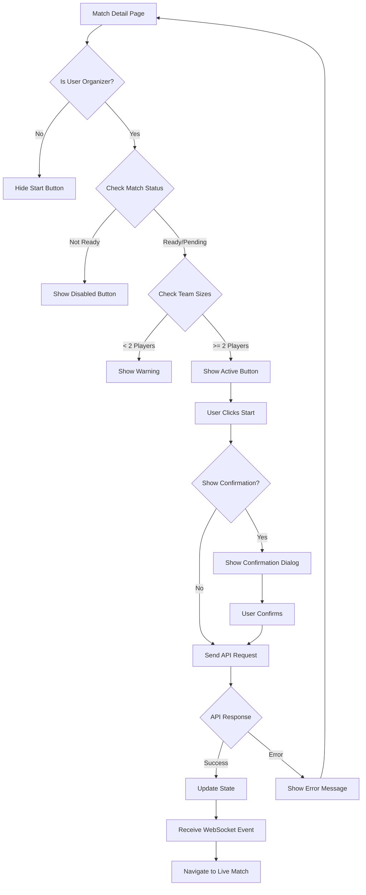

# Frontend Match Start Implementation Guide

## Overview
This guide covers the complete implementation of the **Match Start** feature for frontend developers, including API integration, WebSocket handling, state management, and UI flows.

---

## 📡 API Endpoint

### **Start Match**
```
POST /api/v1/matches/:id/start
```

**Purpose**: Transitions a match from `PENDING_PARTICIPANTS` or `READY` status to `ACTIVE` status.

---

## 🔐 Authentication
**⚠️ Note**: Current implementation does not enforce authentication at the route level. The `initiatorId` in the request body is validated against the match organizer.

**Recommended**: Add authentication headers for future security:
```javascript
headers: {
  'Authorization': `Bearer ${token}`
}
```

---

## 📥 Request Format

### **URL Parameters**
| Parameter | Type | Required | Description |
|-----------|------|----------|-------------|
| `id` | string | ✅ Yes | Match ID (24-char MongoDB ObjectId) |

### **Request Body**
```typescript
{
  initiatorId: string; // Player ID of the organizer (24-char ObjectId)
}
```

### **Complete Example**
```javascript
const matchId = "69787de5fec7b7444cd04181";
const organizerId = "507f1f77bcf86cd799439011";

const response = await fetch(`http://localhost:3000/api/v1/matches/${matchId}/start`, {
  method: 'POST',
  headers: {
    'Content-Type': 'application/json',
  },
  body: JSON.stringify({
    initiatorId: organizerId
  })
});

const match = await response.json();
```

---

## 📤 Response Format

### **Success Response (200)**
```typescript
{
  _id: string;
  name: string;
  description?: string;
  matchDate: string; // ISO 8601 date
  organizerId: string;
  matchType: 'friendly' | 'competitive';
  status: 'active'; // Changed from 'pending_participants' or 'ready'
  teams: [
    {
      teamId: string;
      teamName: string;
      captain: {
        playerId: string | Player;
        confirmationStatus: 'confirmed';
        confirmedAt?: string;
        promotedFrom?: 'auto' | 'manual'; // 'auto' if captain was promoted
      };
      players: [
        {
          playerId: string | Player;
          confirmationStatus: 'confirmed' | 'pending' | 'declined';
          confirmedAt?: string;
          enteringStreak: number; // Captured at match start
          currentStreak: number;
          currentTier?: 'bronze' | 'silver' | 'gold';
        }
      ];
    }
  ];
  createdAt: string;
  updatedAt: string;
}
```

### **Error Responses**

#### **404 - Match Not Found**
```json
{
  "statusCode": 404,
  "error": "Not Found",
  "code": "NOT_FOUND",
  "message": "Match not found or cannot be started"
}
```
**Cause**: Match doesn't exist OR status is not `pending_participants` or `ready`.

#### **400 - Validation Error (Unauthorized)**
```json
{
  "statusCode": 400,
  "error": "Bad Request",
  "code": "VALIDATION_ERROR",
  "message": "Only organizer can start match"
}
```
**Cause**: `initiatorId` doesn't match match `organizerId`.

#### **400 - Validation Error (Insufficient Players)**
```json
{
  "statusCode": 400,
  "error": "Bad Request",
  "code": "VALIDATION_ERROR",
  "message": "Each team must have at least 2 confirmed participants"
}
```
**Cause**: One or both teams have less than 2 confirmed players.

---

## 🎯 Pre-Start Validations

### **Client-Side Checks (Before API Call)**
```javascript
function canStartMatch(match, currentUserId) {
  // 1. Check user is organizer
  if (match.organizerId !== currentUserId) {
    return {
      allowed: false,
      reason: 'Only the match organizer can start the match'
    };
  }

  // 2. Check match status
  if (!['pending_participants', 'ready'].includes(match.status)) {
    return {
      allowed: false,
      reason: `Match cannot be started (current status: ${match.status})`
    };
  }

  // 3. Count confirmed players per team
  const team1Confirmed = match.teams[0].players.filter(
    p => p.confirmationStatus === 'confirmed'
  ).length;
  
  const team2Confirmed = match.teams[1].players.filter(
    p => p.confirmationStatus === 'confirmed'
  ).length;

  if (team1Confirmed < 2) {
    return {
      allowed: false,
      reason: `${match.teams[0].teamName} needs at least 2 confirmed players (currently: ${team1Confirmed})`
    };
  }

  if (team2Confirmed < 2) {
    return {
      allowed: false,
      reason: `${match.teams[1].teamName} needs at least 2 confirmed players (currently: ${team2Confirmed})`
    };
  }

  // 4. Check if match date is in the future (optional)
  const matchDate = new Date(match.matchDate);
  const now = new Date();
  if (matchDate > now) {
    const timeUntilMatch = Math.ceil((matchDate - now) / (1000 * 60)); // minutes
    return {
      allowed: true,
      warning: `Match is scheduled to start in ${timeUntilMatch} minutes`
    };
  }

  return { allowed: true };
}
```

---

## 🔄 WebSocket Integration

### **Subscribe to Match Updates**
```javascript
// Connect to WebSocket
const ws = new WebSocket('ws://localhost:3000/api/v1/ws');

ws.onopen = () => {
  // Subscribe to match updates
  ws.send(JSON.stringify({
    type: 'subscribe',
    matchId: '69787de5fec7b7444cd04181'
  }));
};

ws.onmessage = (event) => {
  const message = JSON.parse(event.data);
  
  switch (message.type) {
    case 'MATCH_STARTED':
      handleMatchStarted(message.data.match);
      break;
    case 'MATCH_UPDATED':
      handleMatchUpdated(message.data.match);
      break;
    // ... other events
  }
};
```

### **Match Started Event**
```typescript
{
  type: 'MATCH_STARTED',
  data: {
    match: {
      // Full match object with status: 'active'
    }
  },
  timestamp: "2026-01-27T10:30:00.000Z",
  matchId: "69787de5fec7b7444cd04181"
}
```

---

## 🎨 UI/UX Implementation

### **Button State Logic**
```javascript
function getStartButtonState(match, currentUserId) {
  const validation = canStartMatch(match, currentUserId);
  
  if (!validation.allowed) {
    return {
      disabled: true,
      label: 'Cannot Start',
      tooltip: validation.reason
    };
  }
  
  if (validation.warning) {
    return {
      disabled: false,
      label: 'Start Match',
      tooltip: validation.warning,
      showConfirmation: true
    };
  }
  
  return {
    disabled: false,
    label: 'Start Match',
    tooltip: 'Click to start the match'
  };
}
```

### **React Example Component**
```jsx
import { useState } from 'react';
import { useNavigate } from 'react-router-dom';

function StartMatchButton({ match, currentUserId }) {
  const [loading, setLoading] = useState(false);
  const [showConfirm, setShowConfirm] = useState(false);
  const navigate = useNavigate();
  
  const buttonState = getStartButtonState(match, currentUserId);
  
  const handleStartMatch = async () => {
    // Show confirmation if needed
    if (buttonState.showConfirmation && !showConfirm) {
      setShowConfirm(true);
      return;
    }
    
    setLoading(true);
    
    try {
      const response = await fetch(
        `${API_BASE_URL}/api/v1/matches/${match._id}/start`,
        {
          method: 'POST',
          headers: {
            'Content-Type': 'application/json',
          },
          body: JSON.stringify({
            initiatorId: currentUserId
          })
        }
      );
      
      if (!response.ok) {
        const error = await response.json();
        throw new Error(error.message);
      }
      
      const updatedMatch = await response.json();
      
      // Success notification
      showNotification({
        type: 'success',
        message: 'Match started successfully!'
      });
      
      // Navigate to active match view
      navigate(`/matches/${match._id}/live`);
      
    } catch (error) {
      showNotification({
        type: 'error',
        message: error.message || 'Failed to start match'
      });
    } finally {
      setLoading(false);
      setShowConfirm(false);
    }
  };
  
  return (
    <>
      <button
        onClick={handleStartMatch}
        disabled={buttonState.disabled || loading}
        title={buttonState.tooltip}
        className="start-match-button"
      >
        {loading ? 'Starting...' : buttonState.label}
      </button>
      
      {showConfirm && (
        <ConfirmDialog
          title="Start Match"
          message={buttonState.tooltip}
          onConfirm={handleStartMatch}
          onCancel={() => setShowConfirm(false)}
        />
      )}
    </>
  );
}
```

---

## 📊 State Management

### **Redux/Context Example**
```javascript
// Action
export const startMatch = (matchId, initiatorId) => async (dispatch) => {
  dispatch({ type: 'START_MATCH_REQUEST', payload: { matchId } });
  
  try {
    const response = await api.post(`/matches/${matchId}/start`, {
      initiatorId
    });
    
    dispatch({
      type: 'START_MATCH_SUCCESS',
      payload: response.data
    });
    
    return response.data;
  } catch (error) {
    dispatch({
      type: 'START_MATCH_FAILURE',
      payload: error.response?.data || { message: error.message }
    });
    
    throw error;
  }
};

// Reducer
const matchReducer = (state, action) => {
  switch (action.type) {
    case 'START_MATCH_REQUEST':
      return {
        ...state,
        loading: true,
        error: null
      };
      
    case 'START_MATCH_SUCCESS':
      return {
        ...state,
        loading: false,
        currentMatch: action.payload,
        matches: state.matches.map(m =>
          m._id === action.payload._id ? action.payload : m
        )
      };
      
    case 'START_MATCH_FAILURE':
      return {
        ...state,
        loading: false,
        error: action.payload.message
      };
      
    default:
      return state;
  }
};
```

---

## 🚨 Error Handling Best Practices

### **Comprehensive Error Handler**
```javascript
async function startMatchWithErrorHandling(matchId, initiatorId) {
  try {
    const response = await fetch(`${API_BASE_URL}/api/v1/matches/${matchId}/start`, {
      method: 'POST',
      headers: { 'Content-Type': 'application/json' },
      body: JSON.stringify({ initiatorId })
    });
    
    if (!response.ok) {
      const error = await response.json();
      
      switch (error.statusCode) {
        case 404:
          showError('Match not found or is no longer available to start');
          // Redirect to match list
          window.location.href = '/matches';
          break;
          
        case 400:
          if (error.message.includes('organizer')) {
            showError('Only the match organizer can start this match');
          } else if (error.message.includes('participants')) {
            showError('Both teams need at least 2 confirmed players');
            // Optionally show team composition
            showTeamStatus();
          }
          break;
          
        case 429:
          showError('Too many requests. Please wait a moment and try again.');
          break;
          
        default:
          showError('An unexpected error occurred. Please try again.');
      }
      
      throw new Error(error.message);
    }
    
    return await response.json();
    
  } catch (error) {
    if (error.name === 'TypeError' && error.message === 'Failed to fetch') {
      showError('Network error. Please check your connection.');
    }
    
    throw error;
  }
}
```

---

## 🔔 Notification Messages

### **Success States**
```javascript
const successMessages = {
  standard: '🎯 Match started! Good luck!',
  withAutoCaptain: '🎯 Match started! Captain(s) were auto-assigned.',
  scheduled: '⏰ Match started ahead of schedule!'
};
```

### **Warning States**
```javascript
const warningMessages = {
  lowPlayers: '⚠️ Match started with minimum player count',
  pendingCaptains: '⚠️ Captains were automatically promoted'
};
```

---

## 🎬 Complete User Flow



---

## 📝 TypeScript Interfaces

```typescript
// Request
interface StartMatchRequest {
  initiatorId: string;
}

// Response
interface Match {
  _id: string;
  name: string;
  description?: string;
  matchDate: string;
  organizerId: string;
  matchType: 'friendly' | 'competitive';
  status: MatchStatus;
  teams: Team[];
  createdAt: string;
  updatedAt: string;
}

enum MatchStatus {
  PENDING_CAPTAIN_CONFIRMATION = 'pending_captain_confirmation',
  PENDING_PARTICIPANTS = 'pending_participants',
  READY = 'ready',
  ACTIVE = 'active',
  COMPLETED = 'completed',
  CANCELLED = 'cancelled'
}

interface Team {
  teamId: string;
  teamName: string;
  captain: Captain;
  players: Player[];
}

interface Captain {
  playerId: string | PopulatedPlayer;
  confirmationStatus: ConfirmationStatus;
  confirmedAt?: string;
  promotedFrom?: 'auto' | 'manual';
}

interface Player {
  playerId: string | PopulatedPlayer;
  confirmationStatus: ConfirmationStatus;
  confirmedAt?: string;
  declinedAt?: string;
  enteringStreak: number;
  currentStreak: number;
  currentTier?: 'bronze' | 'silver' | 'gold';
}

enum ConfirmationStatus {
  PENDING = 'pending',
  CONFIRMED = 'confirmed',
  DECLINED = 'declined'
}
```

---

## 🧪 Testing Checklist

### **Unit Tests**
- [ ] `canStartMatch()` validation logic
- [ ] Error message formatting
- [ ] Button state calculations

### **Integration Tests**
- [ ] Successful match start
- [ ] Authorization failure (non-organizer)
- [ ] Insufficient players error
- [ ] Invalid match status error
- [ ] Network error handling

### **E2E Tests**
- [ ] Complete flow from match detail to live match
- [ ] WebSocket event reception
- [ ] Auto-captain promotion notification
- [ ] Concurrent start attempt handling

---

## 🐛 Common Issues & Solutions

### **Issue 1: "Only organizer can start match" error**
**Solution**: Verify `initiatorId` matches `match.organizerId` exactly (both should be MongoDB ObjectIds as strings).

### **Issue 2: Match status not updating in UI**
**Solution**: Ensure WebSocket connection is active and subscribed to the match before starting.

### **Issue 3: "Each team must have at least 2 confirmed participants"**
**Solution**: Display team composition before allowing start. Show count of confirmed players per team.

### **Issue 4: Button remains disabled after page refresh**
**Solution**: Fetch fresh match data on component mount to get current status.

---

## 📞 API Support

For additional endpoints related to match management:
- `GET /api/v1/matches/:id` - Get match details
- `PATCH /api/v1/matches/:id/confirm-participation` - Confirm player participation
- `PATCH /api/v1/matches/:id/decline-participation` - Decline participation
- `POST /api/v1/matches/:id/result/declare` - Declare match winner

Full API documentation: http://localhost:3000/api/docs

---

## 🔗 Related Documentation
- [WebSocket Implementation Guide](./WEBSOCKET_IMPLEMENTATION.md)
- [Match API Documentation](./API_DOCUMENTATION.md#matches)
- [Authentication Guide](./AUTHENTICATION_GUIDE.md)
